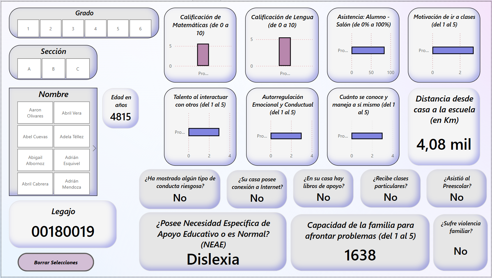
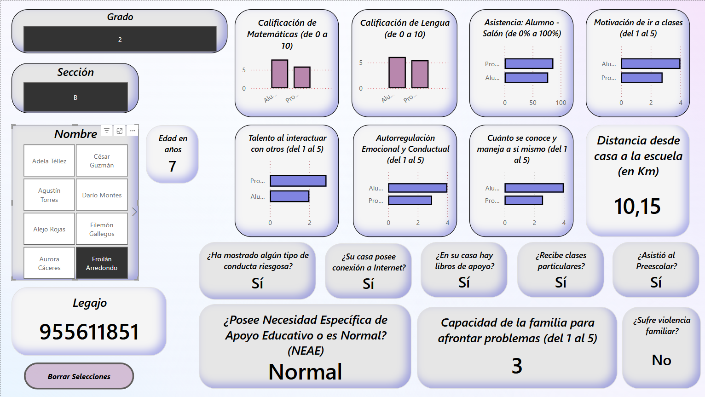

# Dashboard Educativo - Análisis de Estudiantes

Este proyecto consiste en un **dashboard interactivo de Power BI** que permite visualizar y analizar información académica, emocional y sociofamiliar de estudiantes de nivel primario. Su objetivo es facilitar la toma de decisiones educativas basadas en datos.

## 📁 Archivo fuente

- **Fuente de datos:** `simulacion_estudiantes.csv`
- **Registros:** 540 estudiantes
- **Columnas:** Datos académicos, personales, sociales y emocionales (ver sección [Estructura del CSV](#estructura-del-csv))

## 🛠️ Preparación de los datos

1. **Importación manual del CSV:**
   - Se desactivó la detección automática de tipo de datos en Power Query (`No detectar tipo de datos`).
   - Se promovió la primera fila como encabezado.
   - Se eliminó el paso automático de cambio de tipo para evitar errores de interpretación (p. ej., `5.0` como `50`).

2. **Conversión manual de tipos:**
   - Se cambió manualmente el tipo de cada columna para evitar errores de mala interpretación automática.
   - En columnas como `asistencia`, `calificacion_matematica`, `calificacion_lengua`, y `distancia_escuela_km`, se usó la siguiente **Configuración Regional**:
     ```
      Inglés (Estados Unidos)
     ```

     - *Esto asegura que se lean los valores decimales como decimales*

## 🧩 Componentes del Dashboard

### Segmentadores de datos (Slicers)
- **Grado**
- **Sección**
- **Nombre**

### Visualizaciones comparativas (Alumno vs. Promedio del salón)
Utilizando una combinación de medidas DAX y una tabla auxiliar:

1. **Medidas creadas:**
   - `PromedioColumnaSalon`: calcula el promedio para el salón sin incluir al alumno actual.
   - `ColumnaAlumno`: extrae el valor del alumno seleccionado.
   - `ValorComparacionColumna`: retorna el valor correcto según el tipo (Alumno vs. Promedio).

2. **Visualización:**
   - Gráfica de barras apiladas con:
     - Eje Y: `Comparacion[Tipo]`
     - Eje X: `ValorComparacionColumna`

### Tarjetas simples
- Muestran datos individuales como:
  - Edad
  - Distancia a la escuela
  - Legajo
  - Capacidad de la familia para afrontar problemas

### Tarjetas booleanas
- Visualización "Sí / No" de valores booleanos como:
  - ¿Tiene conexión a Internet?
  - ¿Hay libros en casa?
  - ¿Sufre violencia familiar?
  - ¿Mostró conducta riesgosa?

Ejemplo de medida DAX utilizada:
```DAX
TieneInternetEnCasa = 
VAR valor = SELECTEDVALUE(simulacion_estudiantes[internet_en_casa])
RETURN IF(valor = TRUE(), "Sí", "No")
````

## 🎨 Estilo visual

El diseño del dashboard sigue el esquema de colores del proyecto **Dataverity**:

| Elemento        | Color     | Descripción                  |
| --------------- | --------- | ---------------------------- |
| Primario        | `#4247C4` | Morado azulado               |
| Primario claro  | `#91ECFF` | Azúl cielo (claro)           |
| Primario oscuro | `#0108c9` | Azúl tinta                   |
| Secundario      | `#F5F5F5` | Blanco grisáceo              |
| Botones         | `#B887AD` | Rosado con morado            |
| Sombras         | `#0108c9` | Azúl tinta                   |

## 🧾 Estructura del CSV

El archivo contiene 540 registros y 29 columnas. Algunos campos clave:

| Columna                        | Tipo     | Descripción                          |
| ------------------------------ | -------- | ------------------------------------ |
| `nombre`                       | Texto    | Nombre del estudiante                |
| `edad`                         | Entero   | Edad en años                         |
| `grado`, `seccion`             | Texto    | Año y sección escolar                |
| `asistencia`, `calificacion_*` | Decimal  | Indicadores académicos               |
| `motivacion`, `habilidades_*`  | Escala   | Indicadores socioemocionales (1-5)   |
| `tipo_neae`                    | Texto    | Puede ser "Normal", "Dislexia", etc. |
| `internet_en_casa`             | Booleano | Conectividad del hogar               |
| `violencia_familiar`           | Booleano | Riesgos sociales                     |

## 📸 Vista del Dashboard



- *Sin segmentación de datos*



- *Con segmentación de datos*

## ✅ Requisitos para reproducir

* Power BI Desktop (última versión recomendada)
* Archivo CSV original: `simulacion_estudiantes.csv`
* Configuración regional del sistema o del archivo ajustada a idioma Inglés (EE.UU.) para separación decimal `.`

---

Desarrollado por **Raúl Díaz** como parte del **proyecto express #4** formando parte del equipo **Dataverity**.